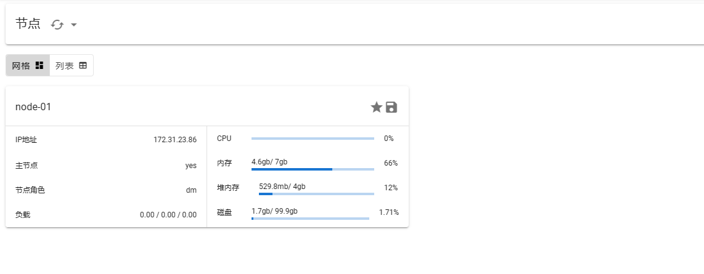
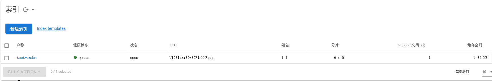

## 修改内核参数最大内存区域限制

宿主机执行

```shell
tee -a /etc/sysctl.conf <<-'EOF'
# 修改最大内存区域限制 ( es )
vm.max_map_count = 262144
EOF

sysctl -p
```

## 执行初始化脚本

宿主机执行，不执行初始化脚本会导致 es 启动报错无权限

```shell
bash init.sh
```

## 执行索引模板创建脚本

启动 es 后在宿主机执行，不需要可以不执行

```shell
bash index-template-config.sh
```






