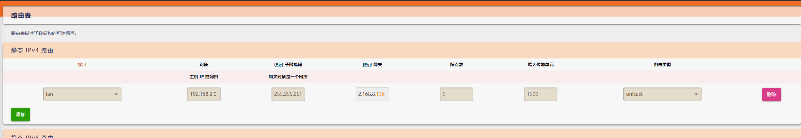

客户端连接服务端正常情况下无需配置 iptables 对数据包进行 ip 伪装，但是只能客户端主机连接远程 vpn 内网，如果想要局域网内主机都可以连接远程 vpn 内网需要 openvpn 客户端配置 ip 伪装并在路由器上添加静态路由

```shell
iptables -t nat -A POSTROUTING -s 192.168.8.0/24 -d 192.168.2.0/24 -j MASQUERADE
```

> 将进入到本机源地址为 192.168.8.0 网段并且目标地址为 192.168.2.0 网段 ( 远程 vpn 内网网段 ) 的数据包进行 ip 伪装后通过本机任意接口转发

然后在路由器上添加静态路由，模式为单播



> 目标网段填写远程 vpn 内网网段，网关填写 openvpn 客户端地址即可实现局域网内主机访问远程 vpn 内网时数据包被转发给 openvpn 客户端主机，openvpn 客户端主机的 iptables 匹配到数据包后进行 ip 伪装转发到远程 vpn 实现局域网内主机可以通过一台 openvpn 客户端连接远程 vpn 内网